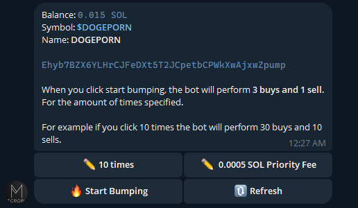
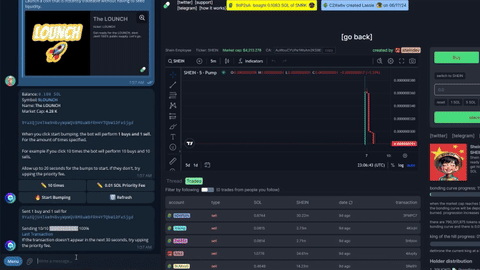

# MicroPump Bot for Telegram 🚀 [Website](https://micropump.fun/)

Hello everyone! I'm excited to introduce the **MicroPump Bot**, a Telegram bot designed to boost your token's visibility by increasing its volume on [pump.fun](https://pump.fun/board).Make your tokens trend on pump.fun.
Enjoy the cheapest and most efficient micro pump bot. 

## 🔗 Bot Link

- **Try it out here**: [MicroPump Bot on Telegram](https://t.me/micropump_bot)

## ⚙️ Core Features

- **Customizable Fees**: Adjust the transaction fees according to your strategy and financial preferences.
- **Easy to Use**: Just paste the CA or the Pump Fun link, and watch your token’s visibility soar.

## 🖥️ Simple UI

## 📈 Transactions

## 🛠️ How to Use

- Deposit funds into your micro wallet.
- Paste the CA or the pump.fun link.
- Start bumping to increase your token's volume.
